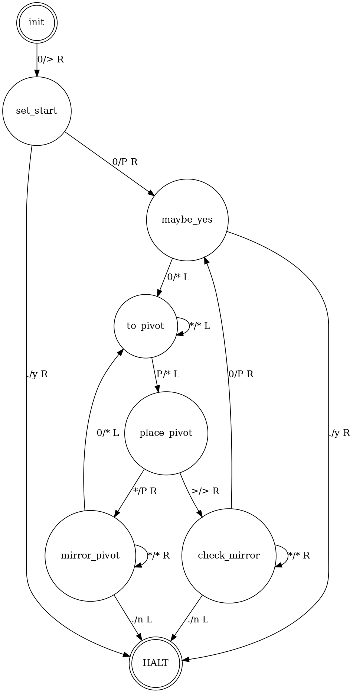

***Turing machine implementation in Haskell with interactive visualization***

*School 42 project*

Install Haskell: https://www.haskell.org/platform/#linux-ubuntu

Build and run: `cabal new-build && ./dist-newstyle/build/x86_64-linux/ghc-8.6.5/ft-turing-0.1.0.0/x/ft-turing/build/ft-turing/ft-turing`

Machines:

- **unary_sub**
     
     A machine able to compute an unary substruction.

     `./ft-turing ./machines/unary_sub.json 11-1=`
     
     output: `1`

     

- **unary_add**
     
     A machine able to compute an unary addition.
     
     `./ft-turing ./machines/unary_sub.json 11+11`

     output: `1111`

     

- **palindrome**
    
    A machine able to decide whether its input is a palindrome or not.
    Before halting, write the result on the tape as a 'n' or a 'y' at the
    right of the rightmost character of the tape.

     `./ft-turing ./machines/palindrome.json PALILILAP`

     output: `PALILILAPy`

     

- 0n1n

     A machine able to decide if the input is a word of the language 0n1n,
     for instance the words 000111 or 0000011111. Before halting, write
     the result on the tape as a 'n' or a 'y' at the right of the rightmost
     character of the tape.

     `./ft-turing ./machines/0n1n.json 0011`

     output: `0011y`

     

- 02n

     A machine able to decide if the input is a word of the language 02n,
     for instance the words 00 or 0000, but not the words 000 or 00000.
     Before halting, write the result on the tape as a 'n' or a 'y' at the
     right of the rightmost character of the tape.

     `./ft-turing ./machines/02n.json 00000000`

     output: `>******Py`

     

- **05 Pseudo universal**
     
     A machine able to run the first machine of this list,
     the one computing an unary addition. The machine alphabet, states, transitions and
     input ARE the input of the machine you are writing, encoded as you see fit.
     
     `      initial-state         &     state-name        { [0/1 state-name </> 0/1] ... } ...*input`

    `./ft-turing ./machines/05_pseudo_universal.json "C&C{[+S>.][.H>.][1C>1]}S{[1P<+][.H<.]}P{[.C>1]}*11111+111111111111111111"`

**Visialisation:**

`d` Move one step forward
`a` Move one step back

`./ft-turing ./machines/unary_add.json 111+11 2>&1 1>/dev/null | python3 vis.py`

`./ft-turing ./machines/05_pseudo_universal.json "C&C{[+S>.][.H>.][1C>1]}S{[1P<+][.H<.]}P{[.C>1]}*11111+111" 2>&1 1>/dev/null | python3 vis.py`

**Generate Graph for machine config:**

`pip3 install graphviz`

.gv file and .pdf

`python3 ./machines/graph_gen.py ./machines/02n.json`

`python3 ./machines/graph_gen.py ./machines/02n.json ./machines/02n.gv`

.png

`dot -Tpng -Gdpi=128 machines/02n.gv > machines/02n.png`
